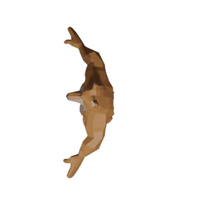
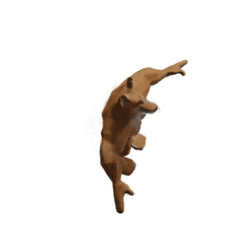

# Neural Radiance Fields (NeRFs)
## Prerequisites

To run this project, you will need:

- A CUDA-compatible GPU (highly recommended for accelerated computation)
- Anaconda or Miniconda installed on your system

## Environment Setup

We use Conda environments to manage dependencies and ensure reproducibility across different setups. Two separate environments are required for this project, one for PyTorch and another for TensorFlow, to prevent dependency conflicts.

### Installing Conda

If you haven't installed Anaconda or Miniconda yet, follow the instructions on the [official Conda website](https://conda.io/projects/conda/en/latest/user-guide/install/index.html) to set it up on your system.

### Creating the Environments

1. **PyTorch Environment**: This environment is optimized for projects using PyTorch. To create it, run the following commands in your terminal:

    ```bash
    conda create --name pytorch_env python=3.8
    conda activate pytorch_env
    conda install pytorch torchvision torchaudio cudatoolkit=11.1 -c pytorch -c nvidia
    pip install -r requirements.txt
    ```

    Replace `cudatoolkit=11.1` with the version that matches your CUDA installation.

2. **TensorFlow Environment**: This environment is set up for TensorFlow projects. Execute the following commands:

    ```bash
    conda create --name tensorflow_env python=3.8
    conda activate tensorflow_env
    pip install tensorflow
    pip install -r requirements.txt
    ```

    Ensure that the TensorFlow version installed is compatible with your CUDA and cuDNN versions.

### Requirements.txt

The `requirements.txt` file should list all the Python libraries that your project depends on. You might need different requirements files for each framework if the dependencies differ significantly. At a minimum, this file should contain:

```bash
numpy
pandas
matplotlib
scikit-learn
```


Add any other libraries your project depends on. If the libraries differ between the PyTorch and TensorFlow environments, consider creating two separate requirements files, e.g., `requirements_pytorch.txt` and `requirements_tensorflow.txt`.


## Overview
NeRFs are a groundbreaking method in computer vision and graphics that allow for the creation of incredibly realistic 3D scenes and novel view synthesis from a limited set of input images. Unlike traditional 3D modeling techniques that rely on explicit geometric representations, NeRFs model a scene implicitly as a continuous 5D function that maps a 3D location and 2D viewing direction to the corresponding color and density.


## How NeRFs Work

### Input
A sparse set of images of a scene captured from different viewpoints along with their corresponding camera poses.

### Representation
A neural network (typically a multilayer perceptron or MLP) is used to represent the scene as a continuous 5D function.

### Training
The neural network is trained to predict the color and density for any given 3D location and viewing direction. This is achieved by minimizing the difference between the rendered images from the NeRF and the input images.

### Novel View Synthesis
Once trained, the NeRF can be used to render photorealistic images of the scene from arbitrary viewpoints by querying the network and applying volume rendering techniques.

## Architecture

The NeRF architecture typically consists of:

- **Input Layer**: Accepts a 3D location `(x, y, z)` and a 2D viewing direction `(θ, φ)`.
- **Fully Connected Layers**: A series of fully connected layers (MLP) with ReLU activations, which process the 5D input to capture complex scene details.
- **Density Output**: A branch of the network outputs the volume density at the input location.
- **Feature Vector**: Another branch processes intermediate features that are concatenated with the viewing direction.
- **Color Output**: A final branch of the network, which takes the concatenated feature vector and viewing direction, outputs the RGB color values.

<br>


## My Implementation

```python
class Nerf(nn.Module):
    
    def __init__(self, Lpos=10, Ldir=4, hidden_dim=256):
        super(Nerf, self).__init__()
        
        self.block1 = nn.Sequential(nn.Linear(Lpos * 6 + 3, hidden_dim), nn.ReLU(),
                                    nn.Linear(hidden_dim, hidden_dim), nn.ReLU(),
                                    nn.Linear(hidden_dim, hidden_dim), nn.ReLU(),
                                    nn.Linear(hidden_dim, hidden_dim), nn.ReLU(),
                                    nn.Linear(hidden_dim, hidden_dim), nn.ReLU())
        
        self.block2 = nn.Sequential(nn.Linear(hidden_dim + Lpos * 6 + 3, hidden_dim), nn.ReLU(),
                                    nn.Linear(hidden_dim, hidden_dim), nn.ReLU(),
                                    nn.Linear(hidden_dim, hidden_dim), nn.ReLU(),
                                    nn.Linear(hidden_dim, hidden_dim + 1),)
        
        self.rgb_head = nn.Sequential(nn.Linear(hidden_dim + Ldir * 6 + 3, hidden_dim // 2), nn.ReLU(),
                                      nn.Linear(hidden_dim // 2, 3), nn.Sigmoid())
        
        self.Lpos = Lpos
        self.Ldir = Ldir
        
    def positional_encoding(self, x, L):
        out = [x]
        for j in range(L):
            out.append(torch.sin(2 ** j * x))
            out.append(torch.cos(2 ** j * x))
        return torch.cat(out, dim=1)
            
                                    
        
    def forward(self, xyz, d):
        
        x_emb = self.positional_encoding(xyz, self.Lpos) # [batch_size, Lpos * 6 + 3]
        d_emb = self.positional_encoding(d, self.Ldir) # [batch_size, Ldir * 6 + 3]
        
        h = self.block1(x_emb) # [batch_size, hidden_dim]
        h = self.block2(torch.cat((h, x_emb), dim=1)) # [batch_size, hidden_dim + 1]
        sigma = h[:, -1]
        h = h[:, :-1] # [batch_size, hidden_dim]
        c = self.rgb_head(torch.cat((h, d_emb), dim=1))
        
        return c, torch.relu(sigma)
        
    
    def intersect(self, x, d):
        return self.forward(x, d)


```

## Input Image and Generated Output

The input to the model were 90 train images of a fox from various angle and depth. To test the model we inputted the poses and intrinsics of 10 test images the generated a final output.






## Applications

- **Virtual and Augmented Reality**: Creating immersive experiences with realistic and interactive 3D environments.
- **Robotics and Autonomous Navigation**: Generating accurate 3D representations of real-world environments for planning and decision-making.
- **Entertainment and Film**: Generating realistic visual effects and virtual sets.
- **Medical Imaging**: Creating 3D reconstructions of organs and tissues for diagnosis and surgical planning.
- **Product Design and Visualization**: Creating interactive 3D product visualizations for marketing and prototyping.

## Advantages

- **Photorealism**: NeRFs can produce highly realistic renderings of complex scenes.
- **Continuous Representation**: Unlike traditional 3D models, NeRFs represent scenes as continuous functions, allowing for smooth transitions between viewpoints.
- **Implicit Modeling**: NeRFs do not require explicit 3D geometry, making them suitable for scenes with complex structures or deformations.

## Limitations

- **Training Data**: NeRFs require a sufficient number of images captured from diverse viewpoints to accurately represent the scene.
- **Computational Cost**: Training and rendering high-resolution NeRFs can be computationally intensive.
- **Generalization**: NeRFs may struggle to generalize to unseen viewpoints or lighting conditions.

## Resources

- **Original NeRF Paper**: Mildenhall et al., 2020
- **NeRF Code Release**: [bmild/nerf on GitHub](https://github.com/bmild/nerf)
- **Awesome NeRF (Curated List)**: [awesome-NeRF on GitHub](https://github.com/awesome-NeRF)
- **NeRF Explained (Papers With Code)**: [Papers With Code NeRF](https://paperswithcode.com/method/nerf)

## Future Directions

- **Real-time Rendering**: Developing techniques for real-time rendering of NeRFs for interactive applications.
- **Dynamic Scenes**: Extending NeRFs to handle dynamic scenes with moving objects.
- **Improved Generalization**: Developing methods for improving the generalization of NeRFs to unseen viewpoints and conditions.
- **Integration with Other Modalities**: Combining NeRFs with other 3D representations like meshes or point clouds.

